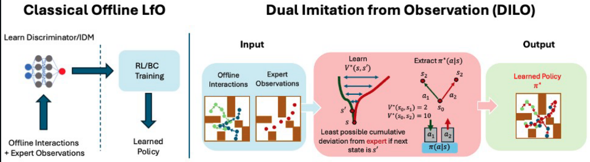

# Dual Imitation Learning from Observations (DILO) 


Official PyTorch implementation for **[A Dual Approach to Imitation Learning from Observations with Offline Datasets)** for CoRL 2024. DILO allows for imitating expert observation (action-free) trajectories using suboptimal data.

<p align="center">
  
</p>

## How to run the code

### Install dependencies

Create an empty conda environment and follow the commands below.

```bash
conda env create -f environment.yml   
conda activate DILO   
```

### Example training code

Locomotion
```bash
python train_dilo.py --env_name=hopper-random-v2 --config=configs/mujoco_config.py --maximizer=smoothed_chi --grad=full  --expert_trajectories=200 --batch_size 1024 --seed=0
```


Kitchen and Adroit
```bash
python train_dilo.py --env_name=hammer-cloned-v0 --config=configs/mujoco_config.py --maximizer=smoothed_chi --grad=full  --expert_trajectories=200 --batch_size 1024 --seed=0
```


## Acknowledgement

This repository builds on the IQL(https://github.com/ikostrikov/implicit_q_learning) codebases. Please make sure to cite them as well when using this code.

